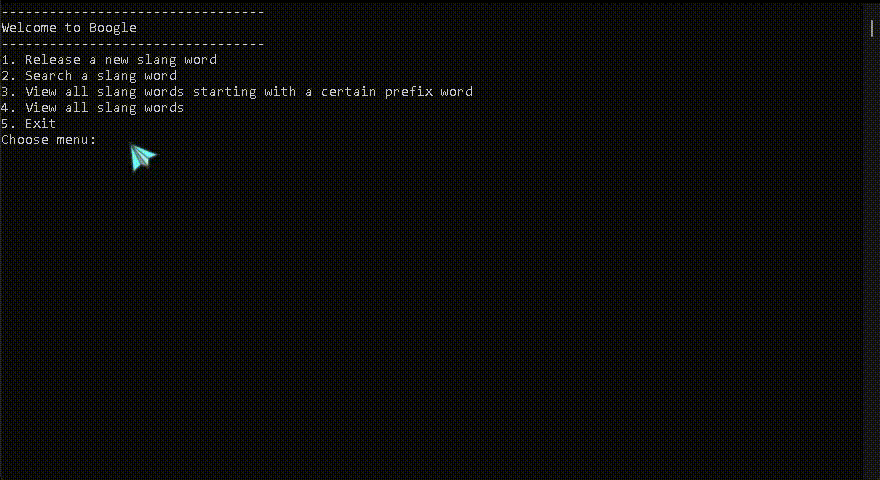

# DataStructure-CaseStudy - Trie-Based Slang Dictionary

## 📌 Project Overview
A C implementation of a **Trie-based dictionary** for managing internet slang words, developed as a case study for Data Structures course.

---

## 🚀 Features
| Feature | Description | Validation |
|---------|-------------|------------|
| **Add New Word** | Stores slang words with descriptions | No spaces, >1 character |
| **Search Word** | Finds exact matches | >1 character, no spaces |
| **Prefix Search** | Lists words starting with prefix | - |
| **View All Words** | Displays all words (sorted) | - |

---

## 🛠️ Technical Implementation
- **Data Structure**: Trie (Prefix Tree)
- **Language**: C
- **Key Functions**:
  - `insertWord()` - Adds new words to Trie
  - `searchWord()` - Exact word search
  - `prefixSearch()` - Finds words by prefix
  - `displayAll()` - Shows all words alphabetically
